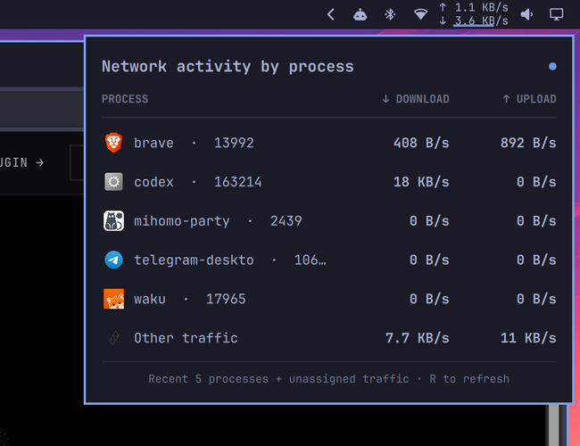

# Network Throughput for Omarchy

A compact Omarchy Quattro bar widget that stacks upload above download and opens a native per-process activity panel.



## Features

- Interface-wide upload and download rates in a narrow two-line bar slot
- Stable recent-process roster that keeps idle apps visible at `0 B/s`
- Per-process TCP throughput without root privileges
- An **Other traffic** row for UDP/HTTP3, proxy/TUN, system-owned, short-lived, and protocol-overhead traffic
- Optimistic background refreshes that keep the last snapshot visible
- Theme-aware native Quattro panel and application icons

## Install

```sh
omarchy plugin add https://github.com/egoist/omarchy-network-throughput.git --enable
```

The widget lands in the right section of the bar. Move it if needed:

```sh
omarchy bar move io.github.egoist.network-throughput --section right
```

## Configure

Set the fixed horizontal widget width (default `68`):

```sh
omarchy bar set io.github.egoist.network-throughput width 68
```

Set the number of recent process rows (default `5`, range `1–10`):

```sh
omarchy bar set io.github.egoist.network-throughput processCount 5
```

## How attribution works

The bar reads the active interface counters in `/sys/class/net`. The panel uses `ss` TCP counters to attribute traffic to user-visible processes, then reconciles the remaining interface bytes as **Other traffic**. This avoids claiming there is no activity when traffic cannot be safely assigned to a process.

Local loopback sockets may seed idle entries in the recent-process roster, but their traffic is never counted against interface throughput.

## Dependencies and security

The plugin runs unsandboxed with your user permissions, like every Omarchy shell plugin. It does not use `sudo`, install packages, start services, or access the network itself.

It uses commands included with a standard Omarchy installation: Bash, `ip`, `ss`, `awk`, `jq`, `sort`, `head`, and `date`.

## Update

```sh
omarchy plugin update io.github.egoist.network-throughput
```

## Remove

```sh
omarchy plugin remove io.github.egoist.network-throughput
```

## License

MIT
